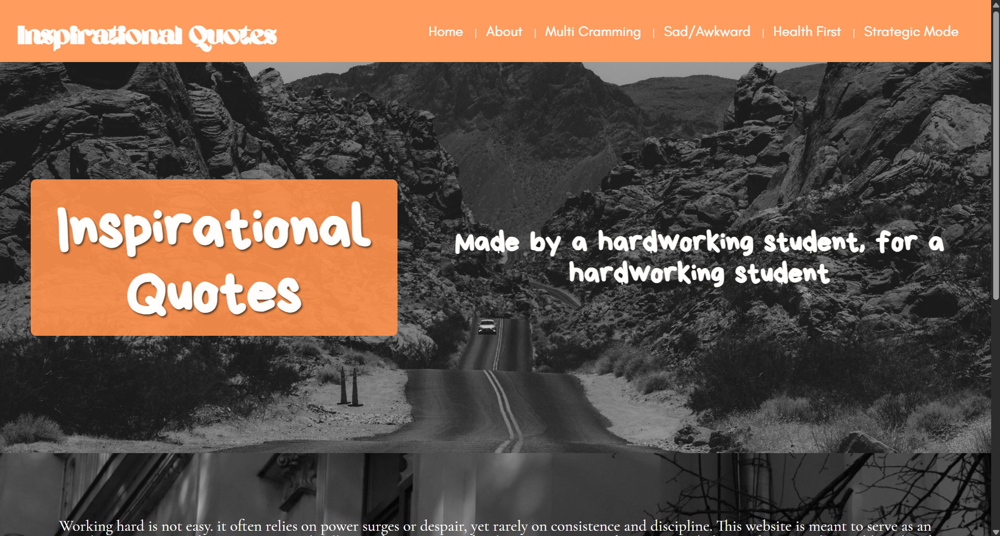
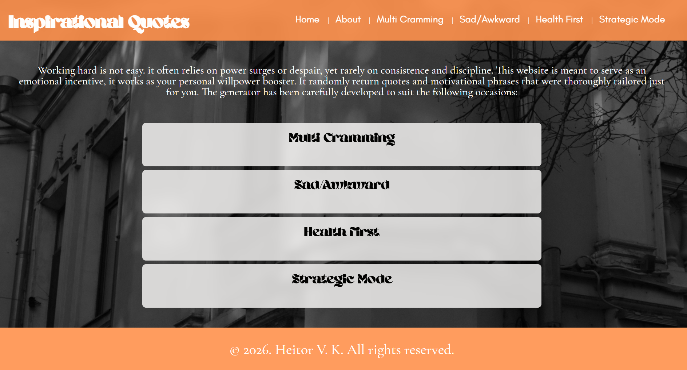
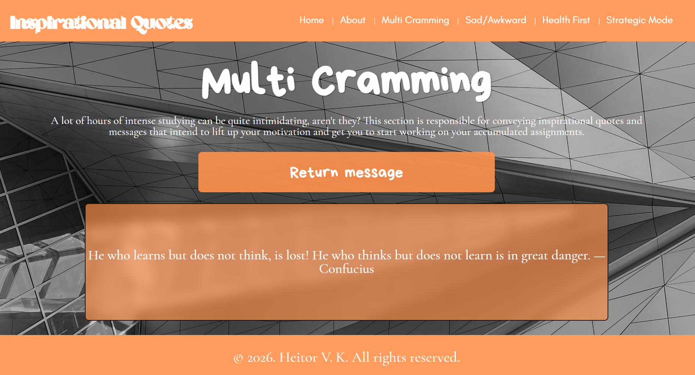

# 𝙸𝚗𝚜𝚙𝚒𝚛𝚊𝚝𝚒𝚘𝚗𝚊𝚕 𝚀𝚞𝚘𝚝𝚎𝚜 

<p align="center"> 
   
</p> 

**"Made by a hardworking student, for a hardworking student."** 

★ Star me on GitHub: your help really motivates me ♥︎ 

## 𝚃𝚊𝚋𝚕𝚎 𝚘𝚏 𝙲𝚘𝚗𝚝𝚎𝚗𝚝𝚜 
+ [Preview](#-preview)
+ [About](#about)
+ [Features](#-features)
+ [Built with](#built-with-۶ৎ)
+ [System](#system)
+ [Live Demo](#-live-demo)
+ [How did this project happen?](#-how-did-this-project-happen?)
+ [License](#-license)
+ [Contact](#contact)

## 📷 Preview 

In addition to the central image, here are extra previews on the website's appearance: 

<p align="center"> 
   
   
</p> 

## About 

**Inspirational Quotes** is a simple website made to convey uplifting messages to help students on a selection of different moods, each page carefully tailoring the most adequate message. The excerpts, from the most various range of people, transmit, each one, a reflection under different perspectives regarding the following situations:

+ **Multi-Cramming** = A term I created, referring to the process of executing multiple tasks under a long span of time. Such process can get tiring, and that's why the website returns messages with the purpose of bringing motivation by reflecting on the weight of life and future.
+ **Sad/Awkward** = Made for these days where you wish you could disappear. Bad days don't last forever. And that's what this page aims to transmit — comforting and cheerful quotes to remember you that every cloud has a silver lining.
+ **Health First** = Studying too much or for way too long certainly has its own consequences, and that's what this webpage expounds on. It is crucial to maintain a balance between cramming and self-care.
+ **Strategic Mode** = This page in specific brings excerpts that consider many aspects regarding life and (of course) studying. It is meant to serve as a hobby made to detox your mind and prepare it for the following work.

The website's three main purposes are: 

+ **Productivity** = It aims to increase your working capacity by lifting your self-esteem up and encouraging your future.
+ **Comfort** = Studying does not have to be draining. That's why comfort was considered one of the most imperative goals from this project.
+ **Self-awareness** = In order to pave your path, you must know yourself first. The quotes were carefully selected with the intention of raising reflection that culminates in self-clarity, being an essential guidance factor in one's career journey.

## 💡 Features 

+ **Mood-based quote categories;**
+ **Random quote generator;**
+ **Anti-repetition system;**
+ **Smooth fade transition between quotes;**
+ **Minimalist and distraction-free design**

## Built with ۶ৎ 

The website is based on three languages: 
+ **HTML** = 6 individual files responsible for the content within;
+ **CSS** = 1 general file for default settings + 6 individual files for specific characteristics;
+ **JavaScript** = 1 general file responsible for interactivity (miscellaneous quote system + fade effect)

## System 

⚙️ Inspirational Quotes uses **JavaScript** as the messenger responsible for the interaction between user and computer. It follows the following structure: 

1. **Global Variables** = Will be used within functions:
```JavaScript
   const button = document.querySelector(".message-button");
   const box = document.querySelector(".box");
   const quote = document.querySelector(".quote");
   let messages = [];
```

2. **Arrays** = Store the quotes; each array will be triggered depending on HTML "diagnostic" IDs, in this case, on the hero section's ID:
```JavaScript
   if (document.querySelector("#multi-hero")) {
    messages = [
   // arrays
   ]
   // Used else if with all other pages
```

3. **Random Quote System** = Works with simple functions to return one of the quotes and guaranteeing the best experience:
```JavaScript
   // function to avoid repeating quotes
   let lastindex = -1;
   function randomMessage() {
    let randomIndex;
   do {
        randomIndex = Math.floor(Math.random() * messages.length);
    } while (randomIndex === lastindex);
   lastindex = randomIndex;
    return messages[randomIndex];
   }

   // show quote
   quote.textContent = randomMessage();

   // button + fade effect
   button.addEventListener("click", () => {
    quote.classList.add("fade-out");
     setTimeout(() => {
        quote.textContent = randomMessage();
        quote.classList.remove("fade-out");
        // forces to repeat animation when the button is clicked again
        void quote.offsetWidth;
     }, 350);
   });
```

## 🌐 Live Demo 

[**🚀 Try the website here ⭑.ᐟ**](https://heitorkohn.github.io/Inspirational-Quotes/) 

## 🤔 How Did This Project Happen? 

This project came up as a **challenge to test my coding skills** until now. I am in the process of getting acquainted with the world of coding, and this was the first suggested initiative I decided to upload to GitHub. I decided to make a simple website for it is better to make something easy that's functional rather than doing something complex but completely non-functional (debugging is so annoying 😭😭). Therefore, I currently upload this project proud of myself, and hope that when I look back in the future, I feel proud of how much I evolved from now. 

## 📃 License 

This product is protected by a license. For more information, verify [𝙻𝚒𝚌𝚎𝚗𝚜𝚎 𝙲𝚘𝚗𝚍𝚒𝚝𝚒𝚘𝚗𝚜](LICENSE). 

## Contact 

🗣️ For more details about the website or anything you judge necessary, feel free to get in touch with me. I am more than happy to answer any questions or comments you may have. You can contact me through: 

+ **My Email** = send me your message at [heitor.kohn@gmail.com](mailto:heitor.kohn@gmail.com)

I hope I can help you and guarantee that you can have a great time with "Inspirational Quotes". 

[Back to top](#𝙸𝚗𝚜𝚙𝚒𝚛𝚊𝚝𝚒𝚘𝚗𝚊𝚕-𝚀𝚞𝚘𝚝𝚎𝚜)
